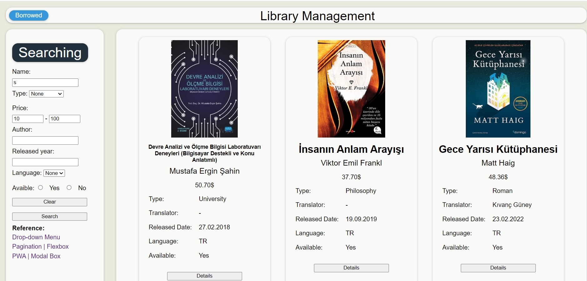
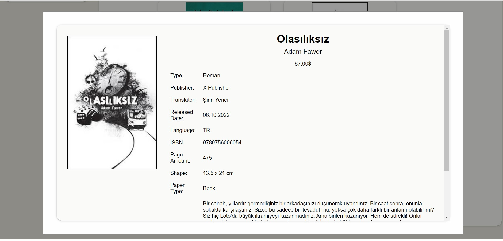
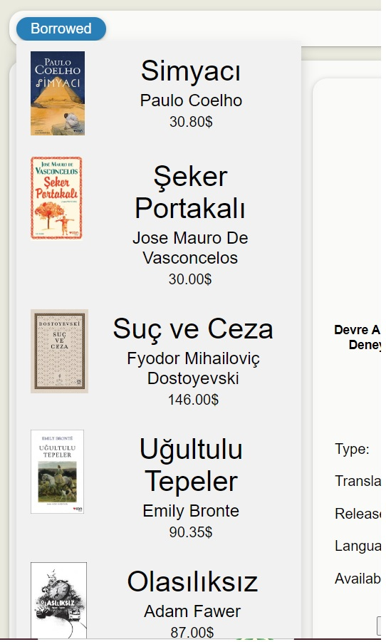

# JS-Library-Management-System

This project only contains JavaScript, HTML and CSS and it is PWA.

-   User can display all the books in library
-   User can borrow books and return them
-   User can search specific features for a book.
-   User can display one book information details.

    </img>
    </img>
    </img>

